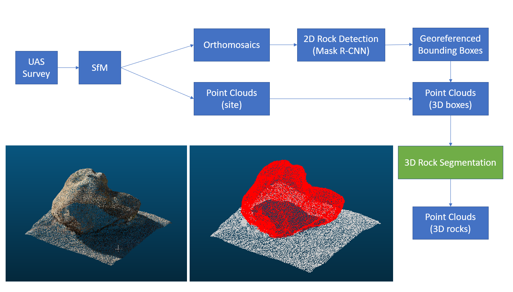

# 3D Rock Detection
## Overview
Recent studies have applied deep learning algorithms to automatically extract rock traits (position, size, eccentricity, and orientation) using 2D orthorectified images, structured from unpiloted aircraft system (UAS) imagery. This repository introduced an offline pipeline for autonomous 3D rock detection, which can improve geometric analysis of geological features such as precariously balanced rocks, rocky slopes, fluvial channels, and debris flows. We first obtain both orthomosaics and point clouds using Structure-from-Motion algorithms on UAS imagery. Using the existing deep learning algorithms for 2D rock detection, individual rocks are identified and localized within 2D bounding boxes in orthomosaics. Based on the georeferences of the 2D bounding boxes, 3D bounding boxes are generated to include individual 3D rocks in point clouds. In each 3D bounding box, we then conduct point-cloud segmentation algorithms to categorize each point, such that the rock points in 3D bounding boxes can be extracted. This offline 3D rock detection pipeline, combining 2D rock detection and 3D rock segmentation, can segment individual rocks in point clouds to obtain accurate 3D geometric properties. Additionally, because rocks and supporting surfaces are semantically categorized, rock basal contact information can also be extracted, which is critical for the fragility study of balanced rocks. Our 3D rock detection extends deep learning applications from 2D geomorphological features to 3D, which supports quantitative research in rock fragility, slope stability, and landscape evolution. 

## Requirements
1. [torch-points3d](https://github.com/nicolas-chaulet/torch-points3d). To install torch-points3d, you need configure its [requirements](https://github.com/nicolas-chaulet/torch-points3d#requirements) first.
2. [laspy](https://laspy.readthedocs.io/en/latest/): `pip3 install laspy`
3. rasterio, geopandas, rioxarray, and pyproj : `pip3 install rasterio geopandas rioxarray pyproj`

## Data
The following data is needed to apply the 3D rock detection. The first two, orthomosaic and mesh models, are obtained from Structure-from-Motion software (e.g., Agisoft). They should have a coordinate reference system of WGS 84 with UTM projection. UTM zones can be found here: https://mangomap.com/robertyoung/maps/69585/what-utm-zone-am-i-in-#. The third data, point cloud, is subsampled from the mesh model. The subsampling can be done in CloudCompare. 
1. Orthomosaic: .tif with WGS 84 and UTM zone
2. Mesh (with texture): .obj with WGS 84 and UTM zone
3. Point cloud: .las, subsampled from .obj

## Workflow

1. 2D rock detection in orthomosaic => bounding boxes
2. Using the detected bounding boxes to crop points in the point cloud => pbr pointcloud candidates
3. Classifying the pbr pointcloud candidates => pbr pointclouds 
4. Segmenting the pbr pointclouds => segmented pbr pointclouds  

The objective of the third step is to reduce false detections from the first step (2D detection). 

## Getting Started
1. UAS-SfM: you need to obtain the [required data](https://github.com/ZhiangChen/rock_detection_3d#data) from UAS-SfM and point cloud sampling. 
2. 2D annotation: you should annotate rocks on orthomosaics and export a shapefile including rock polygons and rock categories. 
3. 2D bounding box extraction: from the above rock polygon shapefile, georeferenced 2D bounding boxes are extracted. Refer to the [notebook](https://github.com/ZhiangChen/rock_detection_3d/blob/main/notebooks/1_extract_bounding_box_from_geotiff.ipynb).
4. 3D rock extraction: this step uses the above georeferenced 2D bounding boxes to crop individual 3D rock point clouds. Refer to the [notebook](https://github.com/ZhiangChen/rock_detection_3d/blob/main/notebooks/2_extract_pointcloud_objects.ipynb).  
5. 3D annotation: the above rock point clouds include both pedestal and PBR points. We need to classify each point in the above rock point clouds. The objective of this step is to annotate points on the rock of interest. Here is a tutorial of using cloudcompare for point annotation: https://www.youtube.com/watch?v=B61WNd7R_w4
6. 3D point segmentation: before you start 3D point segmentation, you should prepare torch-points3d dataset (see a [tutorial of create your own dataset](https://github.com/ZhiangChen/rock_detection_3d/blob/main/notebooks/data/README.md)). You should refer to this [notebook](https://github.com/ZhiangChen/rock_detection_3d/blob/main/notebooks/4_pbr_segmentation_kpconv.ipynb) to train your model. 

## Todo
- mask rcnn training & inference
- shapefile combine
- make the dataset more general
- implement weighted loss to focus on edge point segmentation
- write a trainer class
- try different optimizers
