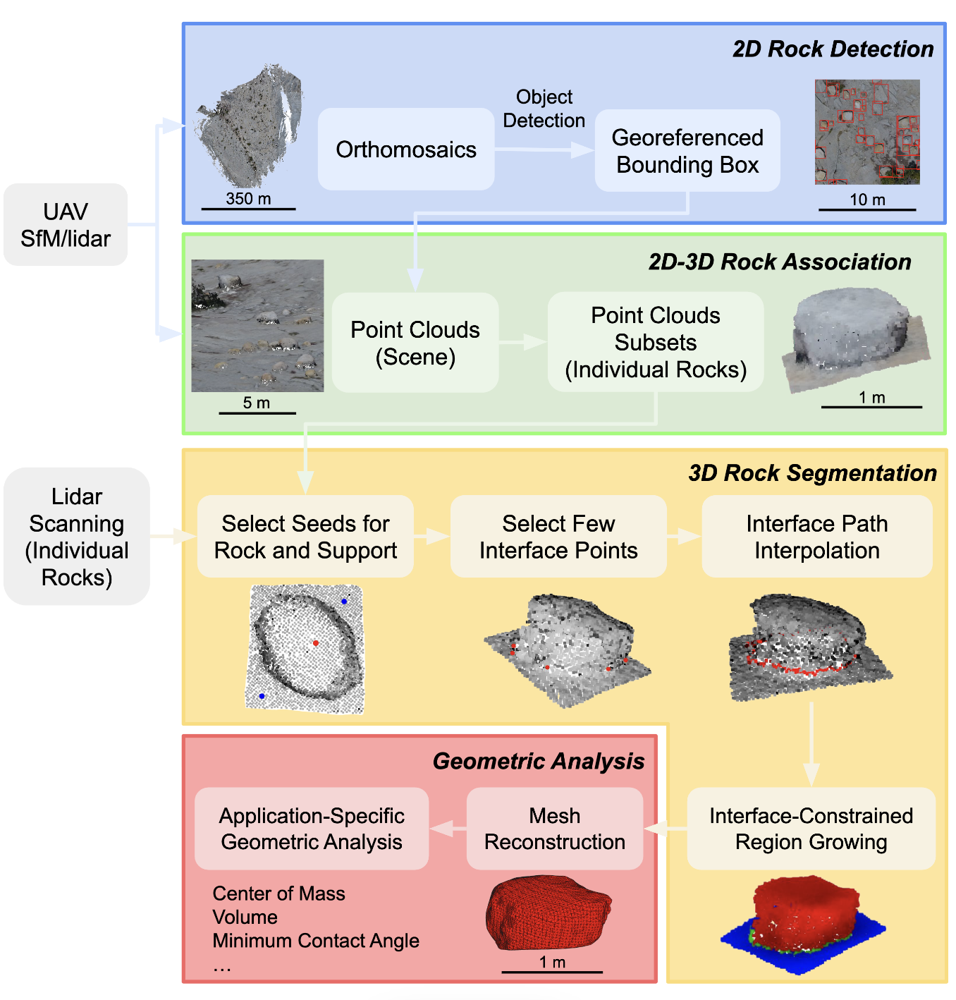
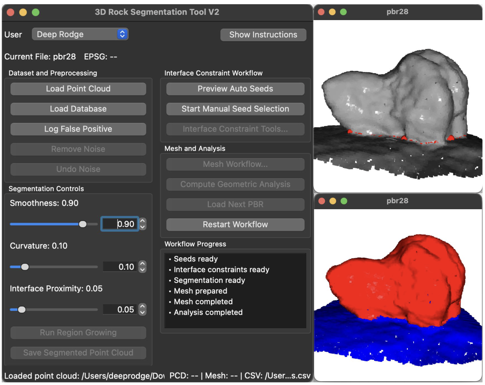
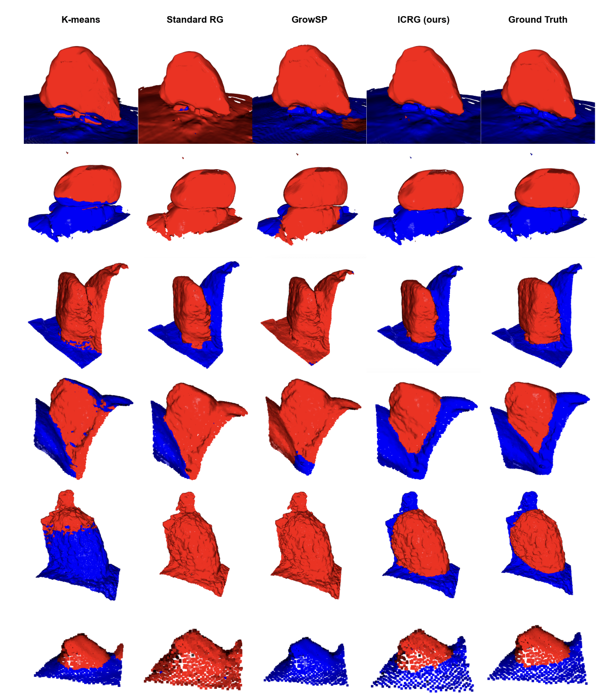
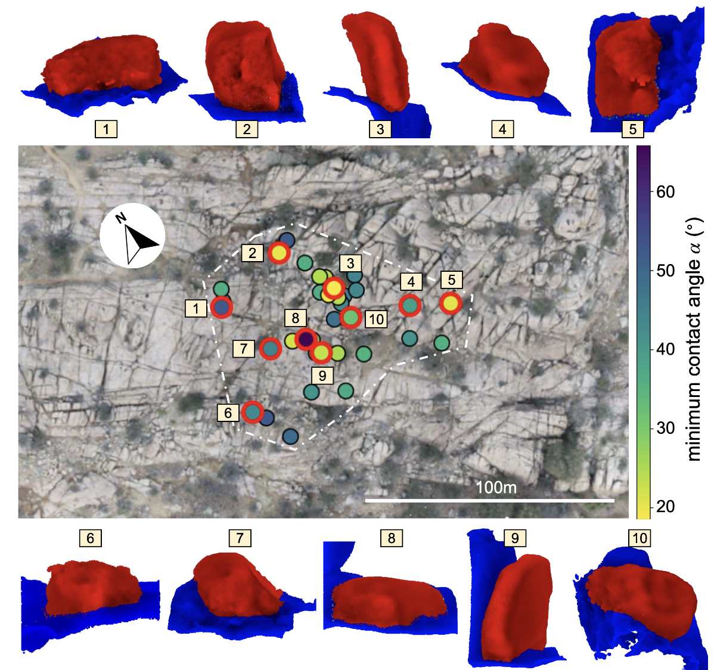

# Mapping, Segmentation, and Geometric Analysis of Freestanding Rocks

This repository contains the code for a workflow that maps, segments, and geometrically analyzes freestanding rocks from UAV Structure-from-Motion (SfM), UAV lidar, and handheld lidar point clouds. The workflow was developed with precariously balanced rocks (PBRs) as a demanding application, but the methods are broadly useful for geoscience problems that require separating a rock body from its supporting surface and reconstructing rock geometry for quantitative analysis.

The core contribution is an integrated pipeline that combines:

1. 2D rock detection on georeferenced orthomosaics,
2. 2D-3D rock association for extracting local rock subsets from scene-scale point clouds,
3. interface-constrained region growing for 3D rock-support segmentation,
4. watertight mesh reconstruction, and
5. application-specific geometric analysis.

## Why This Repository Exists

Freestanding rocks preserve important geometric information for geomorphic interpretation and natural-hazard analysis. For PBRs in particular, geometry and rock-support contact conditions strongly influence stability and fragility. Existing workflows often stop at 2D mapping, require manual segmentation, or rely on case-specific 3D reconstruction, which makes site-scale studies difficult to reproduce and scale.

This repository provides a practical workflow for moving from mapped rocks in orthomosaics to segmented 3D rock geometries and derived measurements such as height, width, center of mass, and minimum contact angle.

## Workflow Overview

For UAV-SfM and UAV-lidar datasets, the full workflow is:

1. Generate orthomosaics and point clouds from remote-sensing surveys.
2. Detect candidate rocks in georeferenced orthomosaics.
3. Use the georeferenced detections to crop individual 3D rock subsets from the scene-scale point cloud.
4. Filter obvious false positives and non-fragile candidates using geometric criteria.
5. Segment each subset into rock and support using interface-constrained region growing.
6. Reconstruct a watertight mesh from the segmented rock.
7. Compute geometric quantities for downstream analysis.

For handheld lidar scans of individual rocks, the workflow can start directly from the 3D segmentation stage.



## Repository Organization

The repository has two main parts.

### Part 1: Mapping, Segmentation, and Geometric Analysis

This part contains the main workflow described in the manuscript.

#### `rock_detection_2d`

This folder contains the 2D detection and 2D-3D association support code.

- `rock_etxtraction_2d_pipeline.py` performs tiled orthomosaic processing and text-guided 2D detection for candidate rocks.
- `generate_pbr_database.py` builds a database of cropped 3D rock candidates and computes geometric screening metrics.
- `filter_flat_rocks.py` removes overly planar or obviously flat candidates.
- `threshold_analyzer.py` helps evaluate geometric thresholds using positive and negative examples.

In manuscript terms, this module supports the 2D rock detection and 2D-3D rock association stages. It is designed to retain likely rock candidates while allowing later geometric filtering and 3D segmentation to refine the result.

#### `rock_detection_3d`

This folder contains the 3D segmentation, mesh reconstruction, and geometry-analysis tools.

- `RegionGrowing.py` implements the region-growing segmentation logic.
- `RegionGrowing_GUI.py` and `RegionGrowing_GUI_refactored.py` provide an interactive GUI for segmentation and analysis.
- `basal_line_processor.py` and `basal_points_algo.py` support user-guided interface definition and basal-contact handling.
- `mesh_processor.py` supports bottom-surface interpolation, normal handling, filtering, and watertight mesh generation.
- `geometric_analyzer.py` computes rock geometry metrics from segmented point clouds and meshes.

This is the main implementation area for the manuscript’s Interface-Constrained Region Growing (ICRG) workflow.

The `rock_detection_3d` module is not just a backend segmentation library. It also includes an interactive GUI designed for geologists and students to load point clouds, select rock and support seeds, define basal or interface points, run segmentation, inspect intermediate outputs, and continue into mesh reconstruction and geometric analysis. This GUI-centered workflow is a major part of the non-learning-based method in this repository.



### Browser-Based Web Tool

The repository also includes a browser-based web tool for the `rock_detection_3d` workflow. It is the recommended interactive interface for current development because it exposes the full segmentation workflow in one place:

- import and export `.rd3dproj` project archives,
- upload LAS/LAZ point clouds,
- select rock and pedestal seeds,
- generate and refine automatic/manual interface constraints,
- run regular region growing and interface-constrained region growing (ICRG),
- inspect voxel-stage RG results, final dense segmentation, seed branches, and interface overlays,
- prepare meshes, reconstruct surfaces, run analysis, and download available outputs.

Install the 3D/web dependencies first:

```bash
pip install -r rock_detection_3d/requirements.txt
```

Launch the web tool from the repository root:

```bash
python -m uvicorn rock_detection_3d.web_app:app --host 127.0.0.1 --port 8010
```

Then open:

```text
http://127.0.0.1:8010/
```

Port `8010` is used here to avoid conflicts with other local services that commonly use port `8000`. If needed, choose another open port and open the matching URL.

For the recommended web-tool workflow and parameter-tuning guidance, see [docs/web_tool_workflow.md](docs/web_tool_workflow.md).

### Part 2: Learning-Based Methods

This repository also includes a learning-based pipeline for autonomous 3D rock detection. At a high level, this branch combines learned 2D rock mapping from orthomosaics with learned 3D point-cloud segmentation on cropped rock subsets. It is the more dataset-driven alternative to the GUI-centered non-learning workflow.

#### `learning_based_rock_detection_2d`

This module contains the learned 2D instance-segmentation components for mapping rocks from orthomosaics, including dataset preparation, Mask R-CNN model definition, and evaluation utilities.

For more detail, see:

- [learning_based_README.md](/Users/zhiang/Projects/rock_detection_3d/learning_based_README.md)
- `notebooks/0_0_generating_tiles_from_shapefile.ipynb`
- `notebooks/0_1_training_2D_instance_segmentation.ipynb`
- `notebooks/0_2_merging_inference_instances.ipynb`

#### `learning_based_rock_detection_3d`

This module contains the learned 3D segmentation data pipeline for point-wise rock labeling from LAS point clouds, including dataset loaders and utilities for `torch-points3d` style experiments.

For more detail, see:

- [learning_based_README.md](/Users/zhiang/Projects/rock_detection_3d/learning_based_README.md)
- [notebooks/data/README.md](/Users/zhiang/Projects/rock_detection_3d/notebooks/data/README.md)
- `notebooks/1_extract_bounding_box_from_geotiff.ipynb`
- `notebooks/2_extract_pointcloud_objects.ipynb`
- `notebooks/4_pbr_segmentation_kpconv.ipynb`

#### How the learning-based branch fits this repository

The learning-based workflow complements the main freestanding-rock analysis pipeline by providing scalable 2D detection and learned 3D segmentation. Compared with the interface-constrained workflow, it places more emphasis on annotated training data, dataset preparation, and notebook-based experimentation.

## Main Methodological Contribution: Interface-Constrained Region Growing

The central method in this repository is interface-constrained region growing for separating a target rock from its supporting surface.

Standard clustering or region-growing methods can spill across the rock-support boundary when the rock and support have similar material, roughness, or local geometry. The approach implemented here addresses that problem by combining:

- rock and support seed points,
- sparse user-defined interface points near the rock-support contact,
- interpolation of those interface points into a dense interface path,
- adaptive neighborhood control near the interface, and
- smoothness and curvature criteria for controlled region growth.

This design keeps the workflow semi-automated: users only guide the ambiguous contact boundary, while the rest of the segmentation, mesh preparation, and measurement pipeline remains automated and reproducible.

Within `rock_detection_3d`, this method is exposed through the GUI so users can iteratively refine seeds and interface constraints, visualize the segmentation results, and move directly into mesh reconstruction without leaving the workflow.

## Sensing Modalities

The workflow is intended for multiple data sources:

- UAV-SfM point clouds and orthomosaics,
- UAV lidar point clouds and orthomosaics,
- handheld lidar scans of individual rocks.

The manuscript shows that point-cloud completeness near the rock-support interface strongly affects downstream segmentation and geometric analysis. Close-range lidar and carefully planned multi-view UAV-SfM often produce better interface geometry than regular grid-style surveys.

## Benchmarking and Assessment

The manuscript evaluates the workflow on datasets from Granite Dells, Arizona, and the southern Sierra Nevada, California. The 3D segmentation method is benchmarked against:

- K-means,
- standard region growing,
- GrowSP.

Across these comparisons, the interface-constrained method performs best overall because it explicitly represents the mechanically meaningful rock-support boundary rather than relying only on feature similarity.



## Geometric Analysis

After segmentation, the workflow reconstructs a watertight rock mesh and computes geometric properties for scientific applications. Depending on the use case, this can include:

- rock height, width, and length,
- height-to-width ratio,
- center of mass,
- basal-contact geometry,
- minimum contact angle for PBR analysis.

For PBR applications, these measurements support geometric fragility assessment and can be used to estimate first-order overturning behavior.



## Notebooks

The notebook workflow in `notebooks/` connects the main stages:

- `0_0_generating_tiles_from_shapefile.ipynb`: generate tiled 2D datasets.
- `0_1_training_2D_instance_segmentation.ipynb`: train and run 2D instance-segmentation models.
- `0_2_merging_inference_instances.ipynb`: merge tile-level predictions into mapped instances.
- `1_extract_bounding_box_from_geotiff.ipynb`: extract georeferenced 2D bounding boxes.
- `2_extract_pointcloud_objects.ipynb`: crop candidate rock point clouds from the full scene.
- `4_pbr_segmentation_kpconv.ipynb`: learning-based 3D segmentation experiments.

Additional dataset-format notes are available in [notebooks/data/README.md](/Users/zhiang/Projects/rock_detection_3d/notebooks/data/README.md).

## Additional Documentation

- [rock_detection_3d/README.md](/Users/zhiang/Projects/rock_detection_3d/rock_detection_3d/README.md): detailed notes on the unsupervised 3D segmentation workflow.
- [rock_detection_3d/GUI_TUTORIAL.md](/Users/zhiang/Projects/rock_detection_3d/rock_detection_3d/GUI_TUTORIAL.md): detailed guide to the interactive GUI.
- [docs/web_tool_workflow.md](docs/web_tool_workflow.md): recommended browser web-tool workflow and parameter-tuning guidance.
- [learning_based_README.md](/Users/zhiang/Projects/rock_detection_3d/learning_based_README.md): learning-based training and inference workflow.

## Data Requirements

Typical inputs include:

- a georeferenced orthomosaic in `.tif`,
- a scene-scale point cloud in `.las` or `.laz`,
- optional mesh products from SfM or lidar processing,
- shapefiles or JSON split files for training and inference workflows.

The existing code and documentation assume georeferenced products, typically in WGS 84 with a UTM projection.

## Summary

At a high level, this repository provides a reproducible workflow for:

- mapping freestanding rocks from remote-sensing data,
- extracting individual 3D rock subsets,
- separating rocks from their supports using interface-constrained segmentation,
- reconstructing watertight meshes,
- computing geometry for geomorphic and hazard applications.

Although the motivating application is precariously balanced rocks, the workflow is useful more broadly for freestanding rock mapping and 3D geometric characterization in geoscience.
