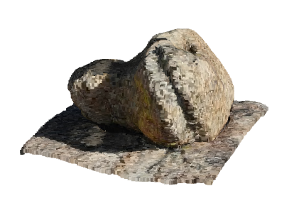
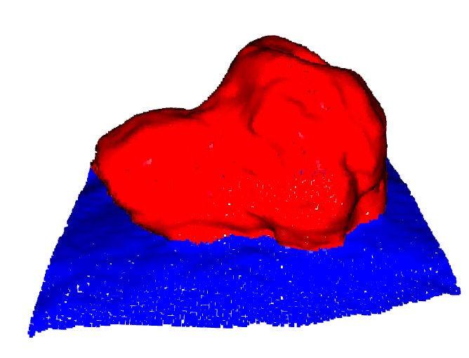
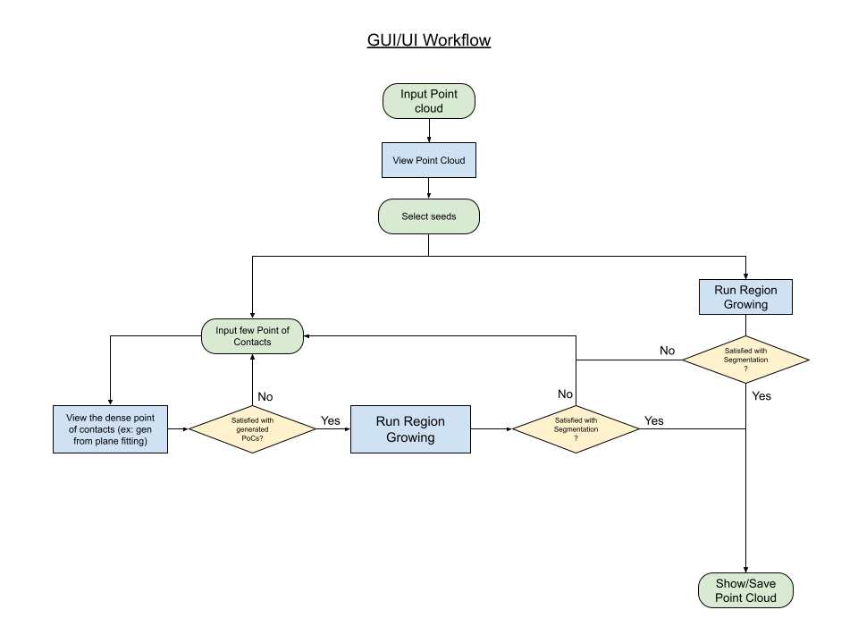
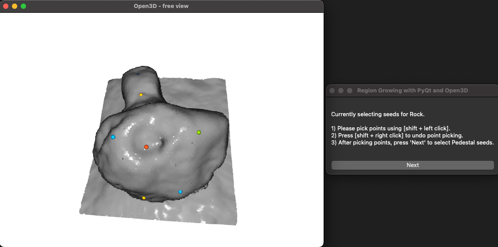
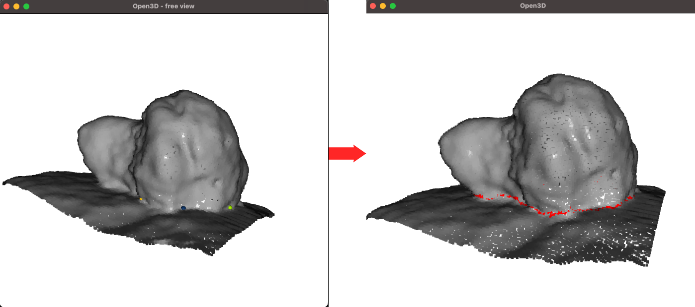
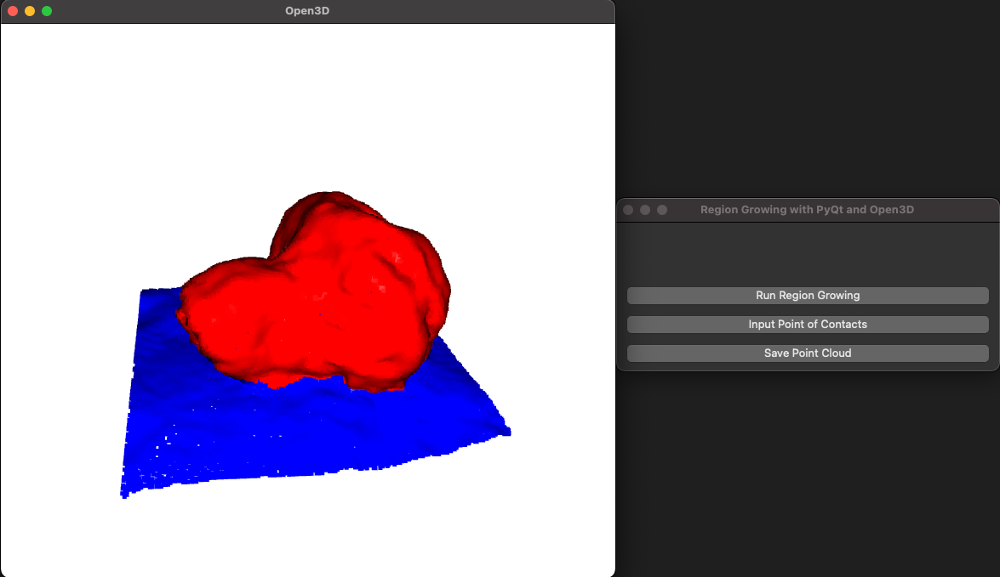
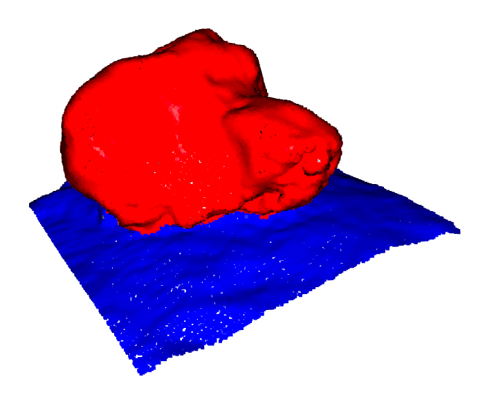
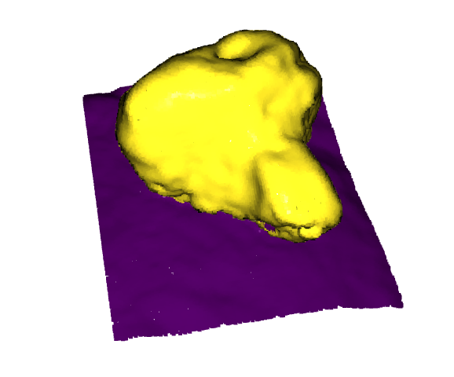
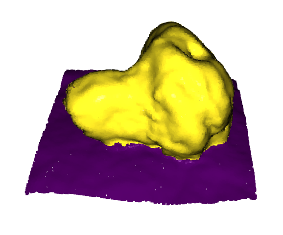

# Unsupervised 3D Rock Segmentation

## Overview

This module extends the 3D Rock Detection project by focusing on unsupervised segmentation techniques for 3D rock point clouds. It emphasizes region growing segmentation and k-means clustering to enhance rock detection accuracy. The region growing relies on seed points and neighboring criteria to expand regions, while k-means clustering technique groups similar points based on their spatial features . These techniques enable precise segmentation of rock points from supporting surfaces, thus facilitating in-depth geometric analysis of geological formations.

To enhance usability and enable interactive control, we have also developed a Graphical User Interface (GUI). The GUI allows geologists and students to run segmentation algorithms, visualize each step, and have control over the segmentation by selecting initial seeds or basal points.

**Original and Segmented point cloud:**

 

## GUI Features

- **Interactive Segmentation**: Users can select seed points and basal points directly on the point cloud visualization to guide the region growing algorithm.
- **Visualization**: Visualize the original, intermediate, and final segmented point clouds with different colors representing different regions.
- **Feedback Incorporation**: Users can iteratively refine the segmentation results by providing feedback and selecting more basal points.



**Interactive Point Selection Visualizer:** <br>


**Basal Estimation:** <br>


**Completed segmentation in GUI:** <br>


## Workflow

The module involves two primary unsupervised segmentation techniques:

### Region Growing Segmentation

1. **Initialization**:

    - Configure the RegionGrowingSegmentation class with the point cloud and segmentation parameters such as voxel size, number of neighbors, smoothness threshold, distance threshold, and curvature threshold.
    - Downsample the point cloud using a voxel grid to reduce computation.
    - Estimate normals for the downsampled point cloud to use in segmentation criteria. Normals are oriented consistently for reliable dot product calculations.
    - Build a KD-Tree for efficient neighbor searches.

2. **Seed Selection**:

    - Compute the bounding box of the point cloud to find the geometric bounds.
    - Determine the centroid of the bounding box in the x and y dimensions.
    - Identify the point with the highest z value near the centroid, representing a potential rock seed.
    - Identify the lowest point in the bounding box, representing a potential terrain seed.

3. **Region Growing (integrating Basal inforamtion)**:

    - Precompute neighbors for each point within the specified distance threshold to speed up segmentation.
    - Initialize regions from the selected seed points (highest point for rocks, bottommost point for terrain).
    - Expand regions from seeds by evaluating neighbors based on the segmentation criteria (normal vector smoothness and curvature):
        - Start with the seed point in a queue.
        - For each point, evaluate its neighbors based on the segmentation criteria.
        - If basal information is available, check if neighbors are near the basal area using the basal proximity threshold. If not, check if they meet the smoothness and curvature thresholds.
        - Add qualifying neighbors to the queue and assign labels to them based on the region they belong to.

4. **Basal Point Handling**:

    The workflow typically follows one of two paths:
    1. If initial segmentation is satisfactory → Use automatic detection (B) → Proceed to mesh reconstruction
    2. If initial segmentation needs guidance → Use manual definition (A) → Re-run segmentation → Proceed to mesh reconstruction

    A. **Manual Basal Line Definition** (Optional):

    - Pair Basal Points: For each pair of consecutive user-input basal points (including the last to the first), follow the steps below:
      - Initialize: Start with the first basal point in the pair.
      - Calculate the direction vector between the two points.
      - Identify candidate points in the point cloud that align with the direction and lie between the two basal points.
      - Select the closest unvisited point from the candidate points.
      - Mark the point as visited and add it to the list of dense points.
      - Repeat until reaching the second basal point or no suitable points are found.

    B. **Automatic Basal Point Detection**:
    - Applied after successful initial segmentation
    - Uses neighborhood analysis to identify transition zones:
      - For each point, examines k-nearest neighbors (default k=30)
      - Calculates ratio of rock-labeled points in neighborhood
      - Points with balanced ratio (between threshold and 1-threshold) are classified as basal
    - These automatically detected points are used for:
      - Generating the bottom surface for mesh reconstruction

5. **Post Processing**:

    - Perform conditional label propagation to assign labels to remaining unlabeled points based on majority labels of their neighbors.
    - Color the segmented point cloud for visualization by assigning different colors to different regions (e.g., red for rocks, blue for terrain).
    - Visualize the segmented point cloud to assess the regions' boundaries.

6. **Bottom Face Generation**:

    - Filter the point cloud to keep only rock and basal points
    - Generate a continuous bottom surface using NURBS (Non-Uniform Rational B-Spline) interpolation:
        - Project basal points onto a best-fit plane for 2D parameterization
        - Create a boundary-aware grid that maintains connection with basal points
        - Fit a NURBS surface through the grid points
        - Generate dense surface points with fine sampling
        - Ensure smooth connection between the surface and basal points
        - Add additional boundary points for better mesh connectivity

7. **Mesh Reconstruction**:

    1. **Point Cloud Preparation**:
        - Combine rock points and generated bottom face points
        - Estimate normals for both sets of points
        - Orient normals consistently

    2. **Poisson Surface Reconstruction**:
        - Perform Poisson reconstruction to generate a watertight mesh
        - Parameters:
            - Depth: 8 (controls mesh resolution)
            - Linear fit: False (better for organic shapes)

    3. **Mesh Export**:
        - Save the reconstructed mesh in PLY format
        - Clean up temporary files

This workflow creates a complete 3D model of the rock, including a geometrically plausible bottom surface. The resulting mesh is watertight and suitable for volume calculations or further analysis.

#### Mathematical Definitions

- **Smoothness**: Smoothness is evaluated using the dot product between the normal of a point and the normals of its second-order neighbors (neighbors of neighbors). For a point $`( p )`$ with normal $`( \mathbf{n}_p )`$, and its second-order neighbors $`( q )`$ with normals $`( \mathbf{n}_q )`$:

  $$\ Smoothness = \min \left( \mathbf{n}_p \cdot \mathbf{n}_q \right)$$

  where $`\cdot`$ denotes the dot product. We use the minimum value to ensure that we capture the maximum deviation, helping to avoid over-inclusion of points in densely packed clouds.

- **Curvature**: Curvature is computed using the cross product of vectors formed by the difference between neighbor normals and the current normal. For a point $`( p )`$ with normal $`( \mathbf{n}_p )`$, and its neighbors $`( q_i )`$ with normals $`( \mathbf{n}_{q_i})`$:

  $$\
  Curvature = \frac{1}{k} \sum_{i=1}^k \left\| \mathbf{n}_{q_i} \times (\mathbf{n}_{q_i} - \mathbf{n}_p) \right\| $$

  where $`\times`$ denotes the cross product, and $`k`$ is the number of neighbors. This measure captures the variation in normal directions, indicating surface roughness.

#### Usage

- We suggest use of only one segmentation criteria, either smoothness or curvature, not both, depending on the specific requirements of your application.

#### Novelty

One significant novelty in our approach is the use of second-order neighbors for smoothness calculation. Our point cloud is densely packed, resulting in neighboring points being very close to one another. This proximity causes the normal orientation differences to appear nearly parallel, leading almost every point to be included in the region. To address this issue, we modified the approach by considering the minimum dot product (maximum deviation) with second-order neighboring points instead of comparing the immediate neighboring points. This adjustment improves the segmentation accuracy by preventing the over-inclusion of points in a region due to near-parallel normals in densely packed clouds.

Results: <br>
 

### K-Means Segmentation

1. Initialization: Configure KMeansSegmentation with the point cloud and clustering parameters.
2. Feature Extraction: Extract features like coordinates, height, slope, and normals, then normalize and weight them.
3. K-Means Clustering: Apply the k-means algorithm to classify points into distinct clusters.

Results: <br>
 

## Requirements

To use this module, the following packages are required:

1. python >= 3.8
2. scikit-learn: For k-means clustering.
3. open3d: For point cloud processing and normal estimation.
4. numpy: For array operations.
5. matplotlib: For visualization of the segmentation results.

Use the following pip command to install them:

```
pip install scikit-learn open3d numpy matplotlib
```

## Getting Started

### Data Preparation

1. Obtain the point cloud data (in .pcd format).
2. Ensure the data is correctly georeferenced for accurate segmentation.

### Running K-Means Clustering

1. Load the point cloud data using open3d as an open3d geometry object.
2. Create an instance of the KMeansSegmentation class by passing the loaded point cloud, desired number of clusters (typically 2 for rock and bedrock), and feature weights.
3. Use the segment method of the class to perform clustering, and then visualize the segmented results using the visualize_segmentation method.

### Running Region Growing Segmentation

1. Load the point cloud data using open3d as an open3d geometry object.
2. Use RegionGrowingSegmentation with appropriate parameters, then perform segmentation using the segment method.
3. Perform postprocessing using conditional_label_propagation method and color the regions using color_point_cloud method.
4. Assess the regions' boundaries by visualizing the segmented point clouds.

<!-- ### Running Region Growing Segmentation:
1. Load the point cloud data using open3d as an open3d geometry object.
2. Use RegionGrowingSegmentation with appropriate parameters, then perform segmentation using the segment method.
3. Assess the regions' boundaries by visualizing the segmented point clouds.
 -->

<!-- 
## Todo
-  -->